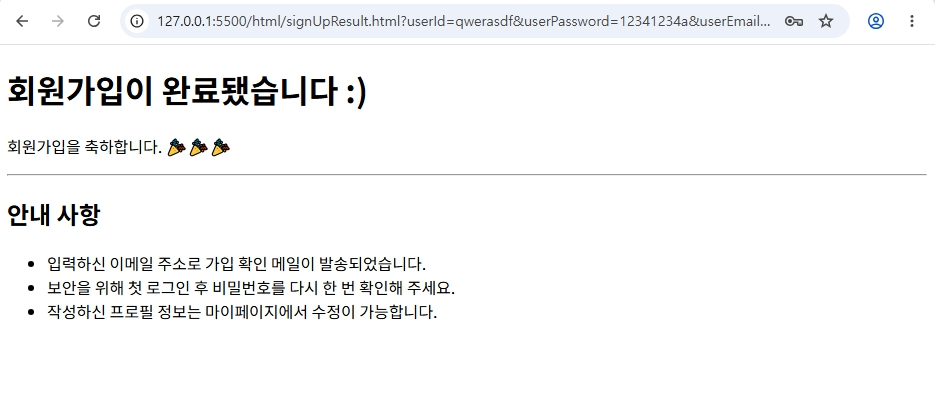

# 💻 skala-front

> **skala-front** 웹 프로그래밍 기초 및 CSS 실습 프로젝트 기록입니다.

---

## 📌 목차 (바로가기)
1. [Project 구성과 index.html 생성](#1-project-구성과-indexhtml-생성)
2. [나의 휴일 일과](#2-나의-휴일-일과)
3. [나의 소개](#3-나의-소개)
4. [나의 강의 일정](#4-나의-강의-일정)
5. [바로가기](#5-바로가기)
6. [회원가입](#6-회원가입)
7. [회원가입결과](#7-회원가입결과)
8. [나의 여행지](#8-나의-여행지)
9. [포털 사이트형 메인 Hub 만들기](#9-포털-사이트형-메인-hub-만들기)
10. [미션 1: 전체 테마 및 텍스트 Styling](#10-미션-1-전체-테마-및-텍스트-styling)
11. [미션 2: 박스 모델의 이해](#11-미션-2-박스-모델의-이해)
12. [미션 3: 가독성 높은 회원가입 폼](#12-미션-3-가독성-높은-회원가입-폼)

---

### 1. Project 구성과 index.html 생성

  

### 2. 나의 휴일 일과

  

### 3. 나의 소개

  

### 4. 나의 강의 일정

  

### 5. 바로가기

  

### 6. 회원가입

  

### 7. 회원가입결과

  

### 8. 나의 여행지

  
  

### 9. 포털 사이트형 메인 Hub 만들기

  
  

### 10. 미션 1: 전체 테마 및 텍스트 Styling

  

### 11. 미션 2: 박스 모델의 이해

  
  

### 12. 미션 3: 가독성 높은 회원가입 폼

  
  

