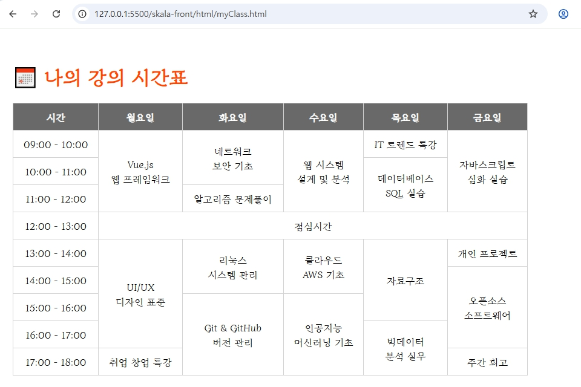
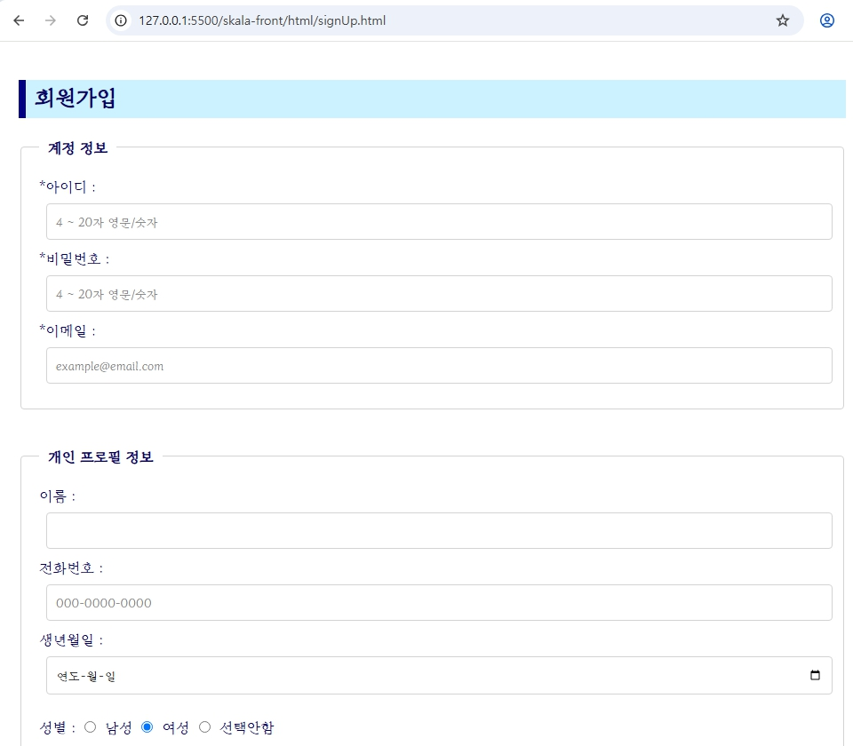
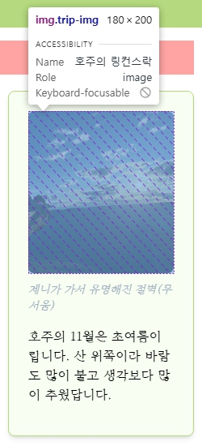
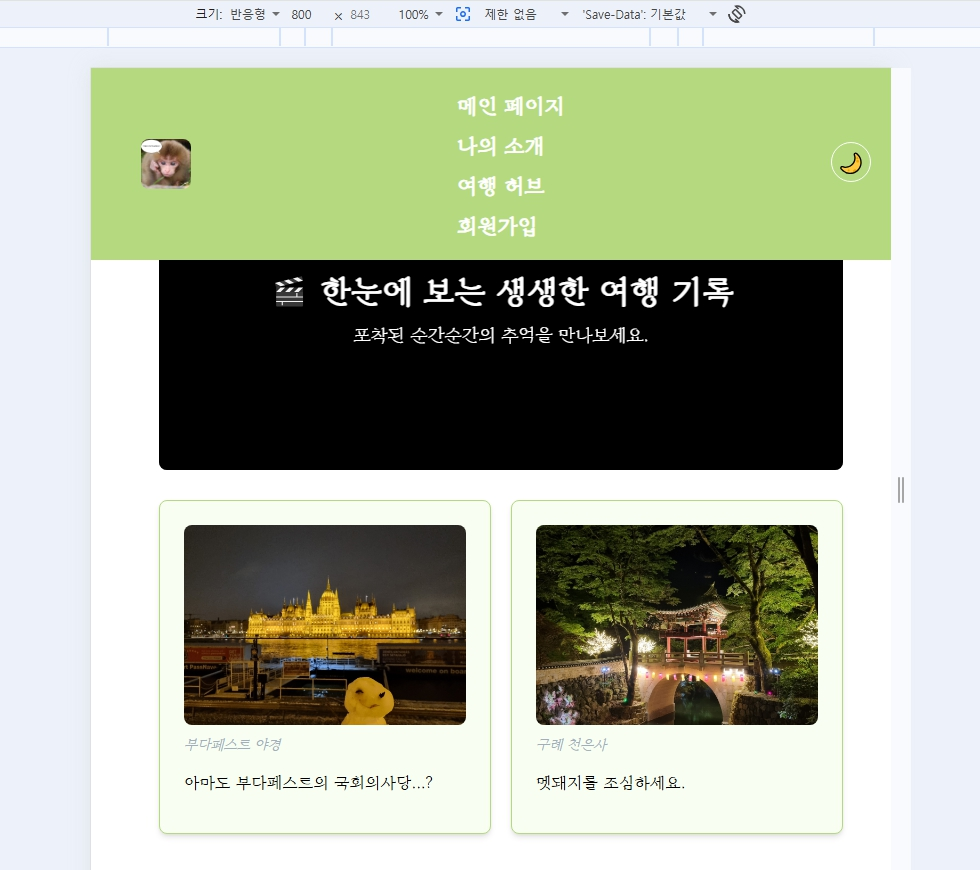

# 💻 skala-front

> **skala-front**는 2026-07-15부터 2026-07-16까지 진행한 HTML · CSS · JavaScript 실습 가이드 결과물을 기록하는 저장소입니다.

---

## 📌 목차 (바로가기)

### 📅 Day 1 실습

- [1. Web Workflow](#1-web-workflow)
- [2. 나의 소개 페이지](#2-my-intro-page)
- [3. 바로가기](#3-shortcut-links)
- [4. 회원가입 Form](#4-signup-Form)
- [5. 여행지 Hub](#5-trip-hub)

### 📅 Day 2-1 실습

- [6. CSS 스타일링](#6-css-styling)
- [7. JavaScript 기초](#7-js-basic-programming)

### 📅 Day 2-2 실습

- [8. DOM / Event](#8-dom-event-practice)
- [9. Async/Module](#9-dom-async-modules)
- [10. Wrap-up Quiz](#10-wrapup-quiz)

### 🏆 종합 실습 (Synthesis)

- [11. 회원가입 & 결과 페이지](#11-signup-and-signupresult)
- [12. 여행지 소개 페이지](#12-trip-info)
- [13. 반응형 상품 카드 갤러리](#13-responsive-item-card-gallery)
- [14. 인터랙티브 할 일 관리 앱](#14-interactive-schedule-app)

---

## 🛠️ 기술 스택 (Tech Stack)

| Category             | Technology                                                   |
| :------------------- | :----------------------------------------------------------- |
| **Markup & Styling** | HTML5, CSS3 (Responsive Design, Grid, Flexbox)               |
| **Scripting**        | JavaScript (ES6+, DOM Manipulation, Event, Async, Fetch API) |
| **Environment**      | Live Server, VS Code                                         |

---

## 📝 실습 내용 및 결과

### 1. Web Workflow

> index.html 열기 → body 문구 한 줄 수정 → 새로고침 확인

  
  

 

### 2. 나의 소개 페이지

> h1 ~ h4 이름 변경 + 앵커 설정

  

 

### 3. 바로가기

> 새 탭 열기(target=\_blank) 동작 확인

  

 

### 4. 회원가입 Form

> 다양한 `input` 타입을 사용하여 회원가입 폼 구성

  

 

### 5. 여행지 Hub

> 이미지 삽입 + 섹션/아티클 생성

  

 

### 6. CSS 스타일링

> 다양한 CSS 수정 + 반응형 확인

  
  

 

### 7. JavaScript 기초

### 8. DOM / Event

> JS 문법 + DOM/Event로 페이지별 목차 자동 생성

  

 

### 9. Async/Module

> 비동기 통신(`fetch`, `async/await`)을 활용해 컴포넌트화된 HTML 및 외부 데이터를 모듈식으로 동적 로드합니다.

  

 

### 10. Wrap-up Quiz

> 클릭형 퀴즈(숫자 맞추기)

  
  
  

 

---

## 종합 실습

### 11. 회원가입 & 결과 페이지

> 회원가입 폼(다양한 input·유효성 검증)을 만들고, 제출 시 입력값을 표로 보여주는 결과 페이지로 이동하는 과제

  required 적용 여부(예시: 아이디)
  pattern 적용 여부(예시: 아이디)
  checkbox required 적용 여부(예시: 약관동의)
   
  회원가입 결과 페이지

필수 요구사항
- [x] 필수 항목(이름·아이디·비밀번호·이메일·약관동의)에 required 적용
- [x] 아이디는 pattern 으로 영문/숫자 4~12자만 허용
- [x] 비밀번호 minlength=8, 전화번호 010-0000-0000 패턴

세부 요구사항
- [x] 성별 radio(단일), 관심분야 checkbox(복수), 지역 select 사용
- [x] 상단 헤더를 position: fixed + z-index 로 고정
- [x] 제출 시 result.html 로 이동해 입력값을 table 로 표시(복수값 포함)
 

### 12. 여행지 소개 페이지

> 시맨틱 구조의 여행지 소개 페이지를 만든다. 고정 내비게이션의 바로가기(앵커), 이미지 갤러리, 영상, 팁(aside)을 배치

  부드럽게 스크롤 내리기 설정
  전체 구조를 시맨틱 요소로 구성
  3열 카드 그리드 레이아웃
  본문 article + 팁 aside 2단 배치
   
  video에 controls, poster 적용
  이미지, 카드 hover 시 scale 확대
  footer에 '맨 위로 가기' 버튼
   img에 alt 설정

필수 요구사항
- [x]전체 구조를 header/nav/main/section/article/aside/footer 시맨틱 요소로 구성 
- [x] 내비게이션을 position: fixed 로 고정하고 링크를 섹션 id 로 연결 
세부 요구사항
- [x] 명소 갤러리를 figure + figcaption 3개 이상으로 구성
- [x] 먹거리 섹션은 본문 article + 팁 aside 2단 배치
추가 요구사항
- [x] video 요소에 controls·poster 적용
- [x] 히어로 배경은 gradient 오버레이 + 이미지, 카드 hover 시 scale 확대
 

### 13. 반응형 상품 카드 갤러리

> 상품 카드 갤러리를 CSS Grid로 배치하고, 화면 폭에 따라 3열→2열→1열로 바뀌는 반응형과 다크모드·hover/등장 애니메이션을 구현

  5개 이상의 색상 변수 정의
  display:grid + repeat(3, 1fr)로 3열 배치 
  Flexbox(space-between, margin-left:auto)
  media로 반응형 페이지 구현 - 1200
  media로 반응형 페이지 구현 - 800
  media로 반응형 페이지 구현 - 800_2
  media로 반응형 페이지 구현 - 500
  다크모드
  카드 hover

필수 요구사항
- [x]:root에 5개 이상 색상 변수 정의 후 전 구간 var() 사용
- [x]상품 카드를 display:grid + repeat(3, 1fr)로 3열 배치(카드 6개 이상)
- [x]상단바·카드 정렬에 Flexbox(space-between, margin-left:auto) 사용
세부 요구사항
- [x]@media로 900px 이하 2열, 600px 이하 1열 + 메뉴 숨김
- [x]카드 hover 시 transform: translateY() + 그림자 강화(transition 포함)
- [x]히어로 문구에 @keyframes 등장 애니메이션, 다크모드 버튼으로 테마 전환
 

### 14. 인터랙티브 할 일 관리 앱

> 할 일을 추가·완료·삭제·필터링하는 앱을 만든다. 데이터는 객체 배열로 관리하고 localStorage에 저장, 로직을 모듈로 분리하며 오늘의 한마디를 비동기로 불러온다. (난이도 중상)

  오늘의 한마디 + 할 일 목록 + 상태 반영
  로컬 스토리지 연동

필수 요구사항
- [x]추가 버튼 또는 Enter 키로 할 일 추가(빈 값 방지)
- [x]체크박스로 완료 토글(취소선), ✕ 버튼으로 삭제
세부 요구사항
- [x]전체 / 진행중 / 완료 필터와 하단 요약(전체·완료 개수)
- [x]이벤트 위임(부모 ul에 리스너 1회)으로 동적 항목 처리
추가 요구사항
- [x]storage.js(데이터) / app.js(화면)로 모듈 분리, type=module 사용
- [x]localStorage로 저장·복원, 오늘의 한마디는 fetch로 로드(실패 시 기본 문구)
